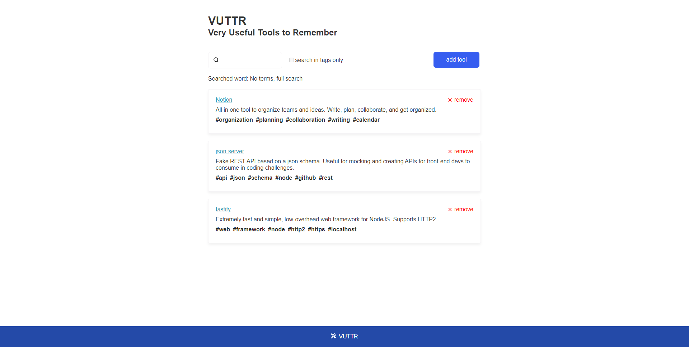
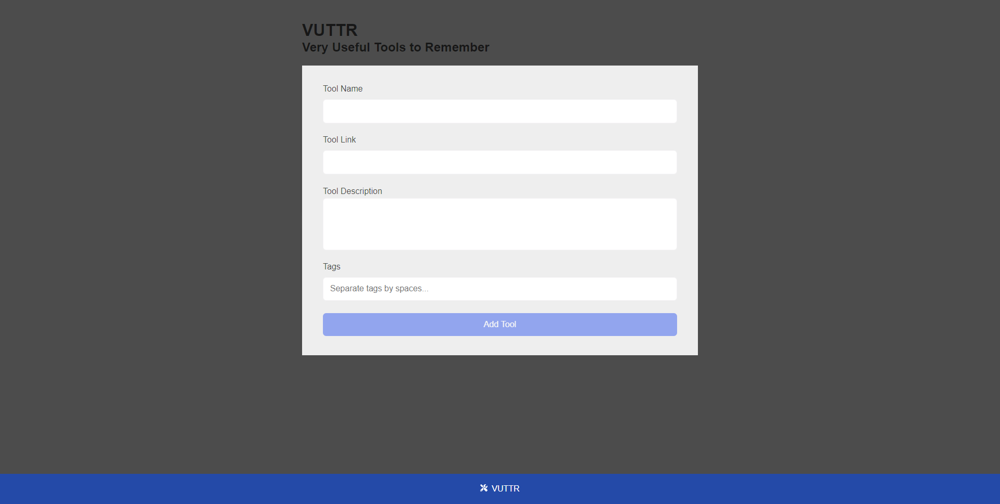
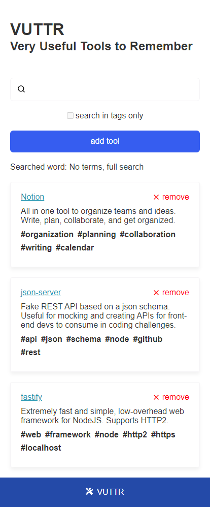

# bossabox-userful-tools
VUTTR (Very Useful Tools to Remember)

------------------------------------------------------------

<p align="center">
   
</p>

<p align="center">	
   <a href="https://www.linkedin.com/in/maicon-boer-35210797/">
      
   </a>

  
  <a href="https://github.com/maiconboer/bossabox-userful-tools/stargazers">
    
  </a>
</p>


# Especificações

* [Tecnologias](#computer-tecnologias)
* [Funcionalidades](#rocket-funcionalidades)
* [Como rodar](#construction_worker-como-rodar)


<p align="center">Web</p>
<p align="center">
   
   
</p>


<p align="center">Mobile</p>
<p align="center">
   
  
</p>

# :computer: Tecnologias
Utiliza as seguintes tecnologias:

**Back-end**
<ul>
  <li>Node.js</li>
  <li>Json-Server</li>
</ul>

**Front-end: Web**
<ul>
  <li>ReactJS</li>
  <li>Styled-Components</li>
  <li>Axios</li>
</ul>

# :rocket: Funcionalidades

* Aplicação simples para gerenciar ferramentas com seus respectivos nomes, links, descrições e tags.

# :construction_worker: Como rodar
```bash
# Clone o Repositorio
$ git clone https://github.com/maiconboer/bossabox-userful-tools.git
```
### 📦 Rode o Servidor/API

```bash
# Acesse a pasta do servidor
$ cd server
# Instale as depedencias
$ npm install
# Inicie o servidor
$ npm start
```
API rodando no endereço: http://localhost:3333/

### 💻 Rode a versão WEB

```bash
# Acesse a pasta web
$ cd web
# Instale as depedencias
$ yarn install
# Inicie a aplicação
$ yarn start
```
Aplicação rodando no endereço: http://localhost:3000/ 

------------------------------------------------------------
